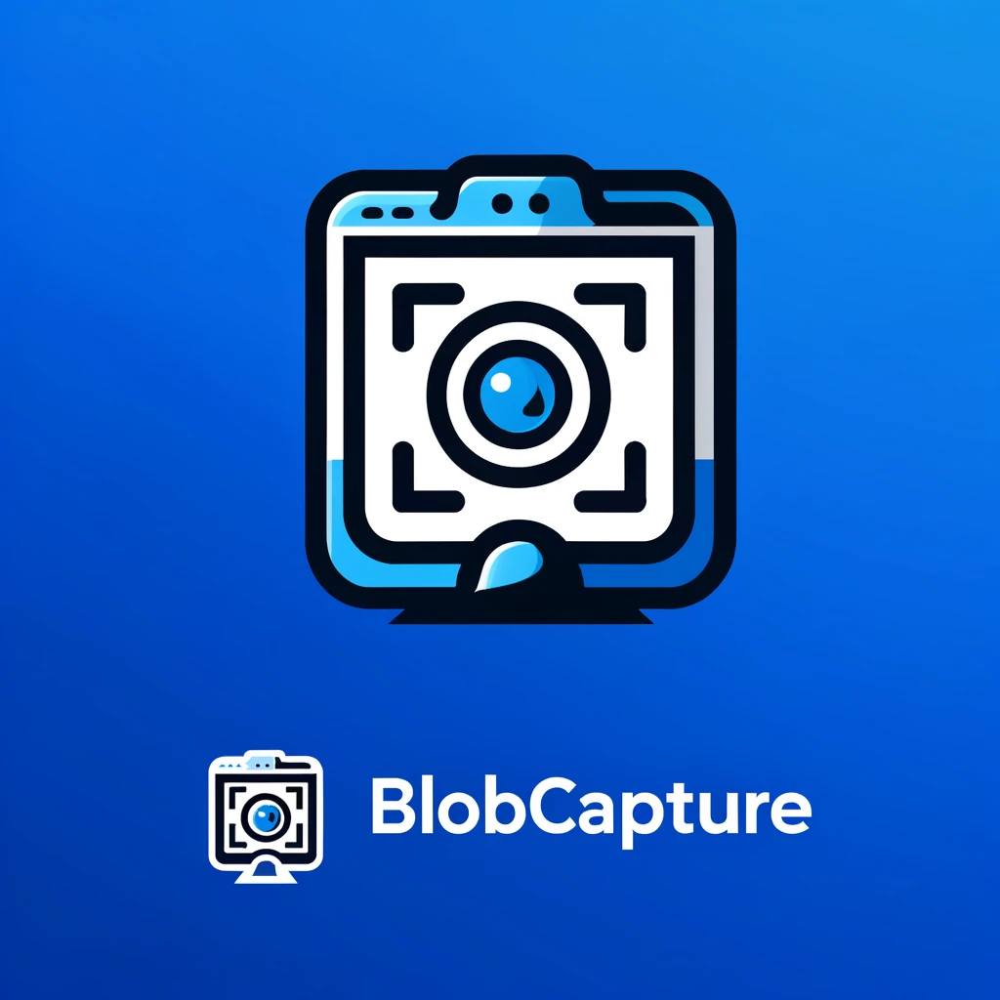

# BlobCapture

BlobCapture is a simple and efficient screenshot capture tool designed to quickly capture any selected region of your screen and store the image in a database as a BLOB. The tool is lightweight and user-friendly, making it perfect for developers or anyone who needs a fast way to capture and store screenshots without additional file system management.

## Why I Built This Application

BlobCapture was built to streamline the process of capturing screenshots and storing them directly in databases as BLOBs (Binary Large Objects). The primary motivation behind this project was to eliminate the need for saving images to file systems, and instead handle all image data within the database itself. This can be especially useful for developers, data analysts, or anyone who deals with applications where image storage in databases is preferred.

## Target Audience

This tool is designed for:
- **Developers** who work with database applications and need a quick way to capture and store screenshots.
- **Database Administrators** looking to integrate screenshot functionality into their management systems.
- **Data Analysts** who want to document visual data directly in databases.
- **General users** who need a simple tool to take screenshots and save them for future use.

## Key Features
- Capture any selected region of the screen.
- Copy the screenshot to the clipboard as Base64 format.
- Store screenshots directly into a database in BLOB format.
- Lightweight, user-friendly interface with an intuitive button to take screenshots.

## Technologies Used
- **Python**: The core language for scripting and implementing the screenshot tool.
- **Tkinter**: Used to create the GUI (Graphical User Interface).
- **Pillow**: For image processing and screenshot capture functionality.
- **PyInstaller**: Used to package the application as a standalone `.exe` file.
- **SQLite**: The database system used for storing screenshots as BLOBs.

## How to Use
1. Download the BlobCapture.exe file from the repository or clone the project.
2. Run the `.exe` file.
3. Click on the "Select Image" button to capture a screenshot of the desired region.
4. The captured screenshot will be automatically copied to the clipboard and can be saved in a database.

## Future Improvements
- Add multi-language support for better accessibility.
- Enhance the GUI with more customization options like changing the screenshot format (PNG, JPEG, etc.).
- Integrate cloud storage options to save screenshots directly to cloud databases.

## Contributions
Contributions are welcome! If you have any suggestions or improvements, feel free to open a pull request or submit an issue.

## License
This project is open-source and available under the [MIT License](LICENSE).
